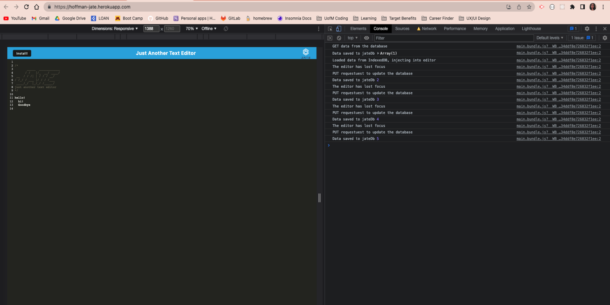
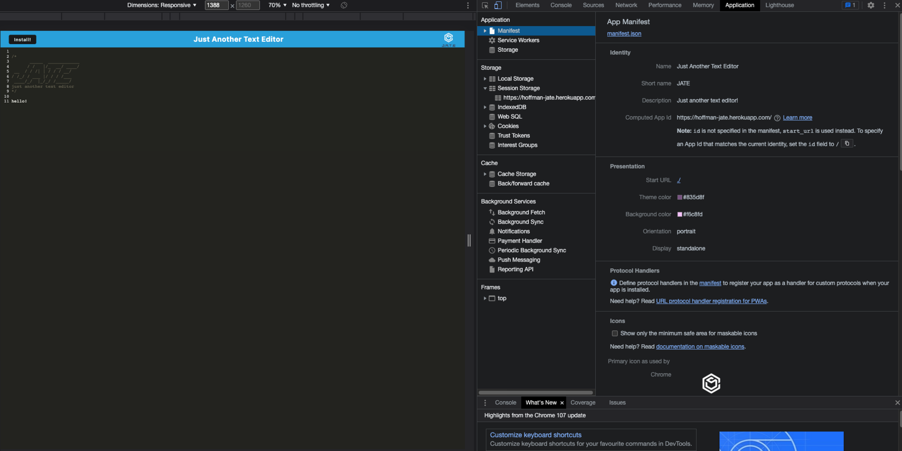
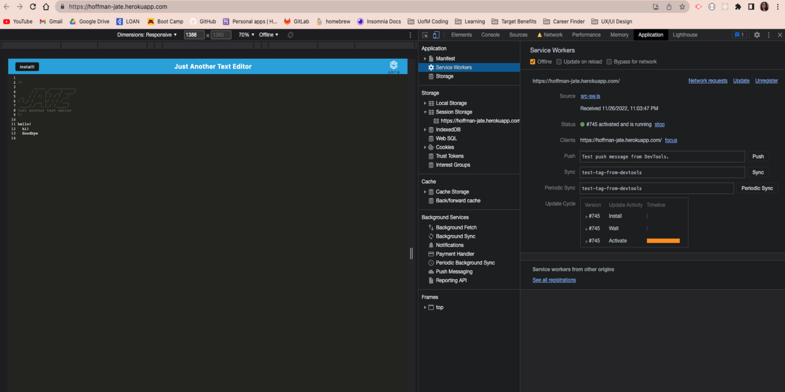

# PWA-Text-Editor

## Description
This text editor was built using an existing application and implementing methods for getting and storing data to an IndexedDB database.

## Table of Contents

- [Installation](#installation)
- [Usage](#usage)
- [Deployed Application](#deployed-application)
- [Demo](#demo)
- [License](#license)
- [Credits](#credits)

## Installation
User will clone the repository. After cloning, run `npm install` to install the dependencies. Then run `npm run build` to generate the /dist folder.

## Usage
Enter `npm run start` into the terminal to open this application on your local machine.

## Deployed Application

Below are links to the heroku deployed website and github repository.

* [Deployed website](https://hoffman-jate.herokuapp.com/)

* [Code repository](https://github.com/dhoffman03/PWA-Text-Editor.git)

## Demo 

* The following image is of the console log:

* The following image is of the manifest:

* The following image is of the service worker:

## License
This application is licensed under MIT.

For detailed information about this license, go to https://mit-license.org/.

## Credits
This project was completed through the University of Minesota Coding Bootcamp
